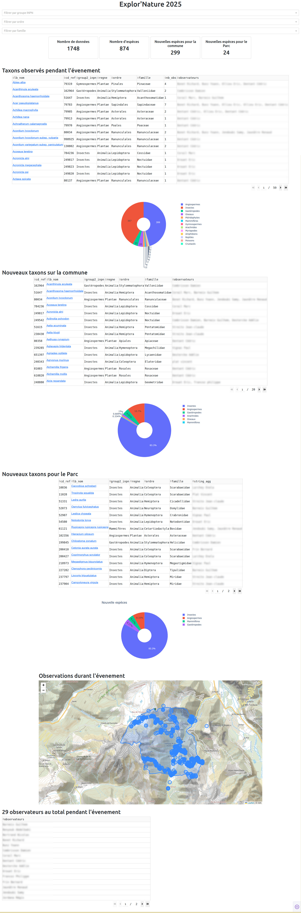

Tableau de bord GeoNature avec Dash
===================================

Cette application permet de générer un tableau de bord de données en se connectant à une base de données GeoNature.
Elle a été utilisée pour restituer en continu et en temps réel les données lors d'un évenement naturaliste : Explor'Nature.

Elle affiche les données d'un jeu de données et d'un zonage géographique comme une commune ou autre (configurable dans le fichier `config.py`) avec les éléments suivants :

- tableau des espèces
- tableau des nouvelles espèces pour la commune
- tableau des nouvelles espèce pour la structure
- graphique de répartition des nouvelles espèces
- carte des observations

Tous les éléments sont filtrables par groupe2 INPN, ordre et famille.

Cette application est entièrement basée sur l'outil Python [Dash](https://dash.plotly.com/) et vous pouvez l'adapter à votre contexte ou la compléter avec les requêtes et restitutions que vous souhaitez.

Installation et lancement
=========================

    # Télécharger ou cloner le dépôt
    # Installer les dépendances
    pip install -r requirements.in
    # désampler le fichier de config et le remplir
    cp config.py.sample config.py
    # Lancer l'application  (par défaut disponible sur : http://127.0.0.1:8050/ )
    python dash_app.py
